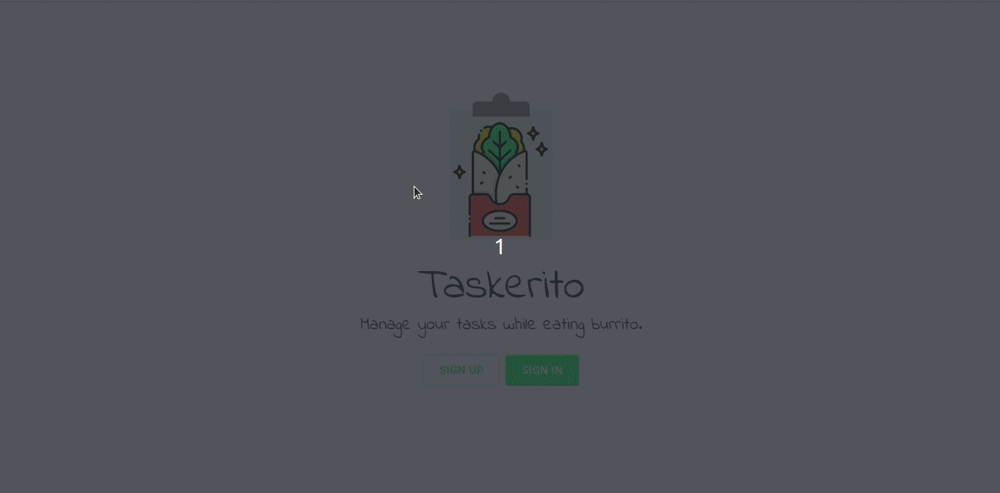
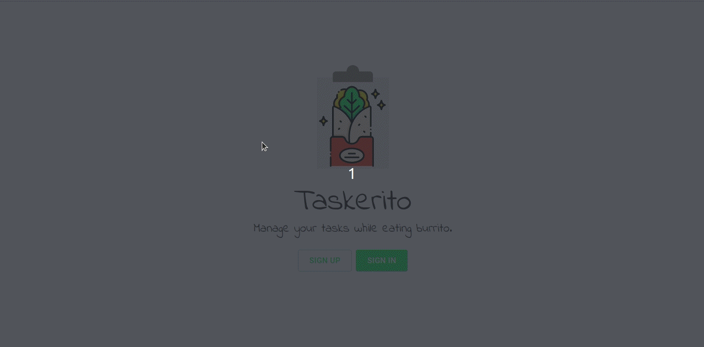
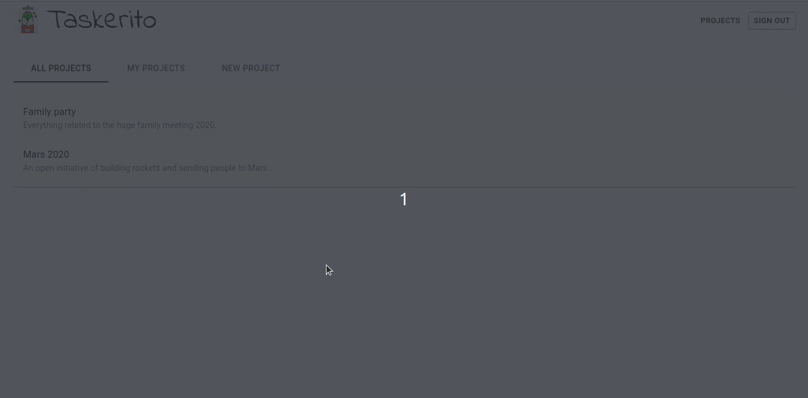
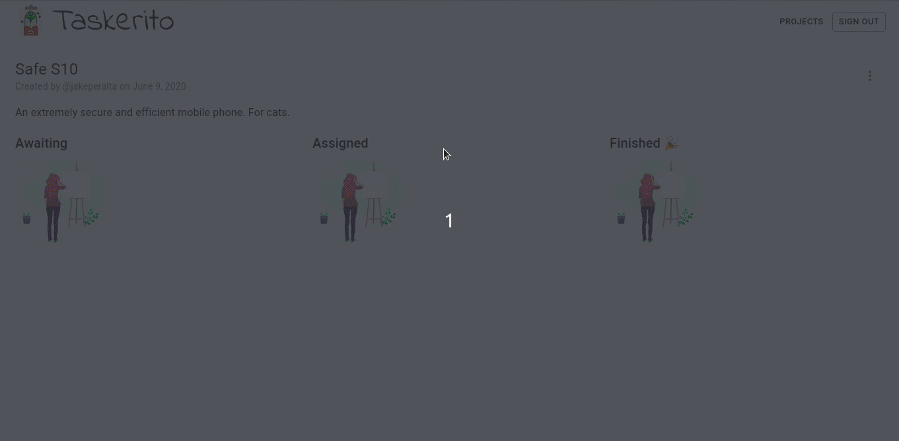
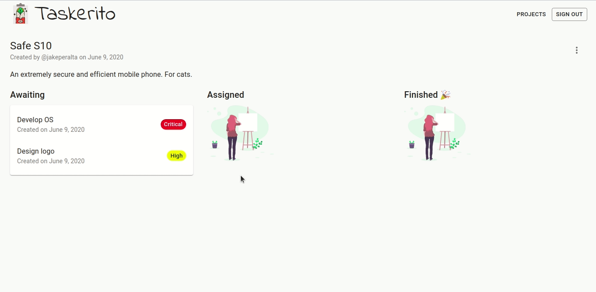
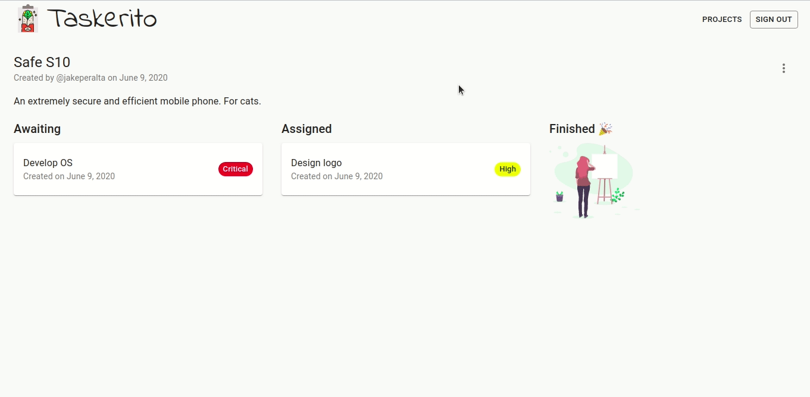
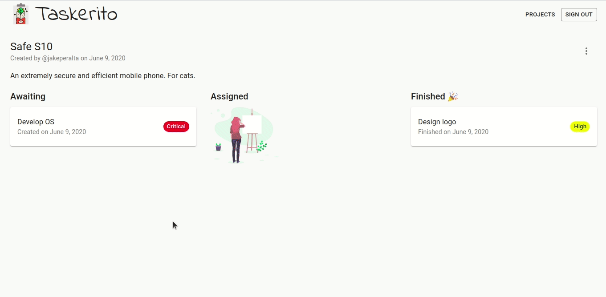

# Taskerito 🌯

Manage your tasks while eating burrito.

*A demo app showcasing GraphQL API built with Elixir and a React client on top of it.*

## Server

See the corresponding [README](./server/README.md) for details.

## Client

See the corresponding [README](./client/README.md) for details.

## Overview

The app is designed for simple project management. An authenticated user
can create projects, tasks and manage their status. There's a simple
interaction through comments and assigning other users to specific tasks.

### Sign up

### Sign in

### Create new project

### Add tasks

### Assign tasks

### Finish tasks

### Post comments

